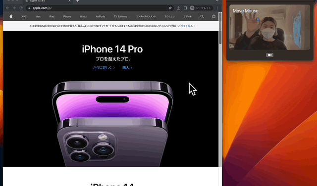

<h1 align="center">TrackpadAir</h1>

<!-- # Badges -->

  <a href="https://github.com/NakaokaRei/TrackpadAir/issues">
  
  <a>
  <a href="https://github.com/NakaokaRei/TrackpadAir/network/members">
  
  <a>
  <a href="https://github.com/NakaokaRei/TrackpadAir/stargazers">
  
  <a>
  <a href="https://github.com/NakaokaRei/TrackpadAir/">
  
  <a>
  <a href="https://github.com/NakaokaRei/TrackpadAir/">
  
  

TrackpadAir is macOS app that allows you to operate without a trackpad.
You can operate the mouse according to your hand movements as follows.

[SwiftAutoGUI](https://github.com/NakaokaRei/SwiftAutoGUI) is used for mouse operation.

> **Warning**
> This app only works on Apple Silicon.

# Installation
## Manually
* Download the [latest release](https://github.com/NakaokaRei/TrackpadAir/releases/latest).
* Extract `TrackpadAir.app` from `TrackpadAir.zip`

# Contributors

- [NakaokaRei](https://github.com/NakaokaRei)

<!-- CREATED_BY_LEADYOU_README_GENERATOR -->

# License
MIT license. See the [LICENSE file](/LICENSE) for details.